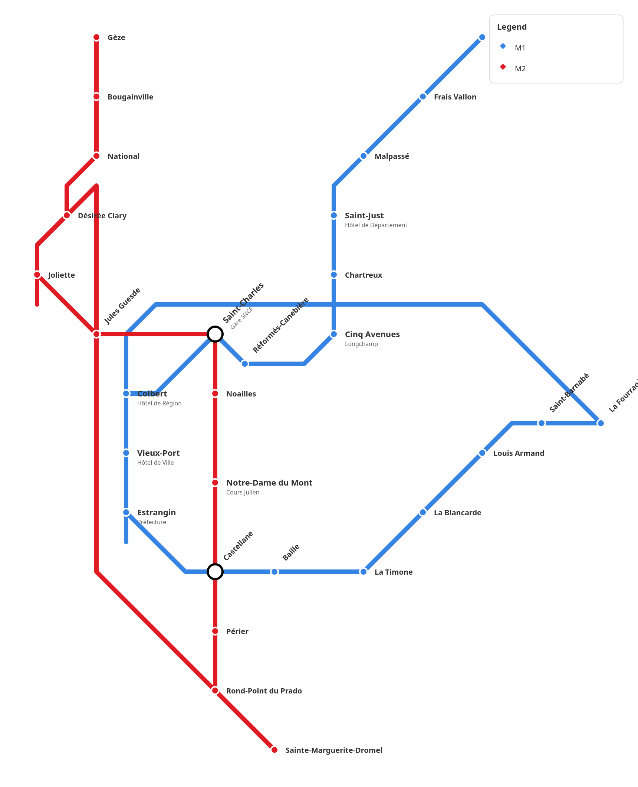

# WikiTransport

A web-based schematic transit map editor. Design clean, shareable
transport network diagrams directly in your browser — no server needed.



## Features

- **Schematic editor** — SVG-based canvas with snap-to-grid, pan/zoom, drag & drop
- **Lines & stations** — Create lines with custom colors, add stations, reorder via drag
- **Transit types** — Group lines by mode (Metro, Tram, Bus, etc.) with distinct icon shapes
- **Anchor points** — Add curve control points on lines for fine-tuned routing
- **Views** — Create named views with per-view station positions and visibility toggles
- **i18n** — English and French interface
- **Offline-first** — All data stored locally in IndexedDB via Dexie

## Tech stack

| Tool | Purpose |
|---|---|
| [Svelte 5](https://svelte.dev) + [Kit](https://kit.svelte.dev) | UI framework (runes, snippets) |
| [TypeScript](https://www.typescriptlang.org) | Type safety |
| [Tailwind CSS v4](https://tailwindcss.com) | Styling |
| [Dexie.js](https://dexie.org) | IndexedDB wrapper (client-side storage) |
| [Melt UI](https://melt-ui.com) | Accessible UI primitives (dropdowns, popovers) |
| [Paraglide JS](https://inlang.com/paraglide) | i18n |
| [svelte-dnd-action](https://github.com/isaacHagoel/svelte-dnd-action) | Drag & drop reordering |
| [Material Icons](https://fonts.google.com/icons) | Iconography |

## Getting started

```bash
pnpm install
pnpm dev
```

Open the URL printed in the terminal (default `http://localhost:5173`).

### Other commands

| Command | Description |
|---|---|
| `pnpm build` | Build for production |
| `pnpm preview` | Preview production build |
| `pnpm check` | Type-check with `svelte-check` |
| `pnpm lint` | Lint with Prettier + ESLint |
| `pnpm format` | Format code with Prettier |

## Data model

```
Project → TransitType → Line → RoutePoint → Station
         → View → ViewStation
         → AnchorPoint
```

Everything is stored in a single IndexedDB database (`TransitDB`) using
Dexie. No backend or API required.

## Usage

1. **Create a project** — Give it a name and city
2. **Add transit types** — Define modes (Metro, Bus, etc.) with icon shapes
3. **Add lines** — Choose a type, set a color, give it a name
4. **Place stations** — Click the add button (or press `S`), then click on the canvas
5. **Build routes** — Drag stations onto a line's route list in the left panel
6. **Style the map** — Adjust station positions, label directions, line z-order
7. **Create views** — Make named variants with hidden lines and repositioned stations

### Keyboard shortcuts

| Key | Action |
|---|---|
| `S` | Toggle station placement mode |
| `A` | Toggle anchor point placement mode |
| `Esc` | Cancel placement / deselect |
| `D` | Deselect all |
| `Delete` / `Backspace` | Delete selected item |

## Project structure

```
src/
├── lib/
│   ├── components/
│   │   ├── editor/       # Editor panels (LeftPanel, RightPanel, ToolBar, properties)
│   │   ├── schematic/    # PlanView (SVG canvas)
│   │   └── ui/           # Reusable UI components (Button, Dialog, Select, etc.)
│   ├── services/         # Dexie-backed CRUD services
│   ├── store/            # EditorState (Svelte 5 runes)
│   ├── types/            # TypeScript models
│   └── utils/            # textMeasure utility
└── routes/
    ├── +page.svelte      # Project list
    └── project/[id]/     # Editor page
```

## License

MIT
