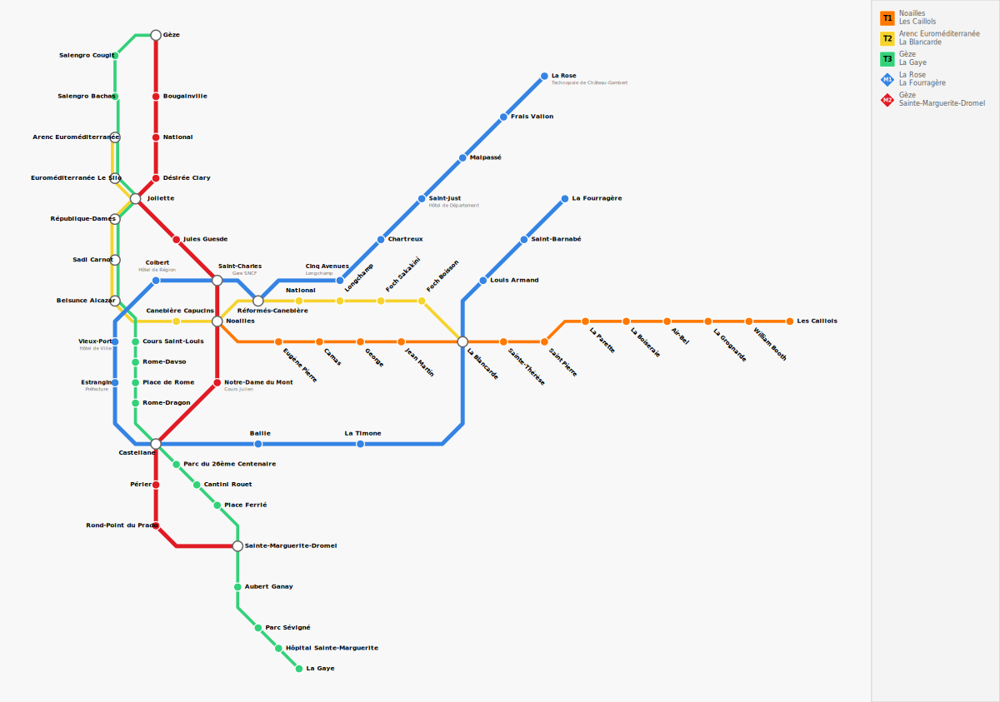
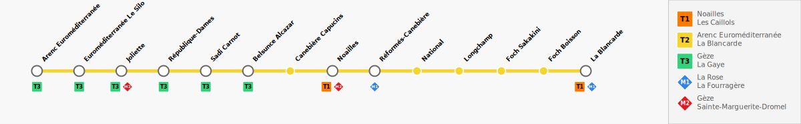

<p align="center">
  
</p>

<h1 align="center">WikiTransport</h1>

<p align="center">
  <em>Design clean, shareable transit maps directly in your browser — no server, no account, no fuss.</em>
</p>

<p align="center">
  <a href="https://github.com/RedsTom/WikiTransport">GitHub</a> ·
  <a href="#features">Features</a> ·
  <a href="#getting-started">Getting Started</a>
</p>

<p align="center">
  <a href="https://wikitransport.redstom.fr">Try it online →</a>
</p>

<br>


---

WikiTransport is a browser-based schematic map editor for metro, tram, bus, and rail networks.
Think of it as a lightweight, client-only alternative to professional diagramming tools — made
for transit enthusiasts, urban planners, students, and anyone who wants to draw beautiful
transport maps without installing anything.

Everything runs locally in your browser. Your projects stay on your machine.

---

## Features

- **SVG schematic editor** — Snap-to-grid canvas with smooth pan, zoom, and drag
- **Octilinear routing** — Lines naturally follow 45° angles; parallel lines are managed automatically
- **Lines, stations & anchor points** — Build networks with custom colors, icon shapes, and fine-tuned curves
- **Transit types** — Group lines by mode (Metro, Tram, Bus, Funicular…) each with its own badge shape
- **Views** — Create named variants with per-view station positions and hidden elements for focused exports
- **Interchange badges** — Circle, square, diamond, or pill badges with 8-directional positioning
- **SVG export** — Production-ready diagrams with legend, badges, and full styling
- **Import / Export (.wtp)** — Share projects as ZIP files, compatible across devices
- **Bilingual** — English & French interfaces
- **100 % local, 100 % private** — No server, no sign-up, no telemetry, no data leaves your machine
- **Open source** — MIT license

## Example maps

| Global view (Marseille)                                      | Line detail (T2)                                     |
| ------------------------------------------------------------ | ---------------------------------------------------- |
|  |  |

## Getting started

```bash
pnpm install
pnpm dev
```

Open the URL printed in the terminal (default `http://localhost:5173`).

### Other commands

| Command        | Description                    |
| -------------- | ------------------------------ |
| `pnpm build`   | Build for production           |
| `pnpm preview` | Preview production build       |
| `pnpm check`   | Type-check with `svelte-check` |
| `pnpm lint`    | Lint with Prettier + ESLint    |
| `pnpm format`  | Format code with Prettier      |

## Quick start

1. **Create a project** — Give it a name and a city
2. **Add transit types** — Define the modes (Metro, Tram, Bus…) with icon shapes
3. **Add lines** — Pick a type, choose a color, name your line
4. **Place stations** — Press `S`, then click the canvas
5. **Build routes** — Drag stations into a line's route list
6. **Polish** — Adjust positions, label directions, line ordering, interchange badges
7. **Export** — Save as SVG or share a `.wtp` project file

### Keyboard shortcuts

| Key                    | Action                             |
| ---------------------- | ---------------------------------- |
| `S`                    | Toggle station placement mode      |
| `A`                    | Toggle anchor point placement mode |
| `Esc`                  | Cancel placement / deselect        |
| `D`                    | Deselect all                       |
| `Delete` / `Backspace` | Delete selected item               |

## Who is it for?

- **Transit enthusiasts** who want to draw their city's network or redesign it
- **Urban planners & students** creating diagrams for presentations or theses
- **Wikipedia editors** and **OpenStreetMap contributors** illustrating transit articles
- **Game & worldbuilders** designing fictional transit systems

## License

MIT
